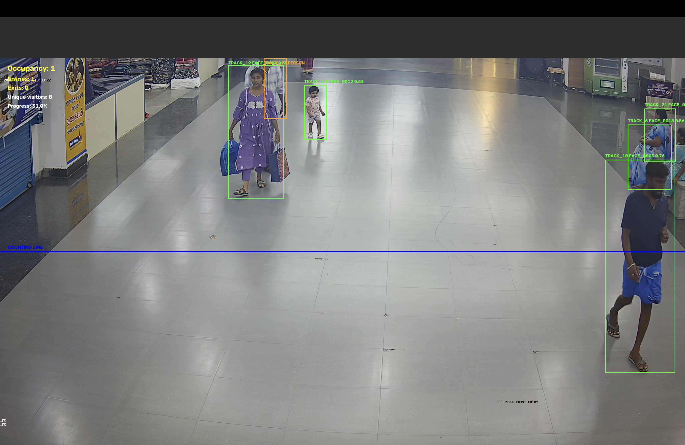
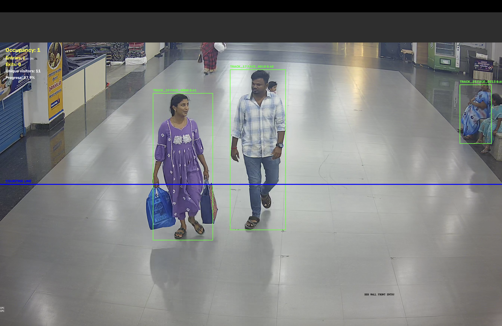

# 🚶 Katomaran Intelligent Face Tracker

> A real-time computer vision pipeline for **face detection, tracking, recognition, entry/exit counting, and occupancy monitoring** from video streams.

<p align="center">

**Detect • Track • Recognize • Count • Monitor**

</p>

---

## 📌 Overview

**Katomaran Intelligent Face Tracker** is a computer-vision system designed to analyze surveillance-style video and extract meaningful visitor analytics.

The system combines:

- 🎯 Face detection
- 🧠 Face recognition
- 🆔 Persistent identity assignment
- 🚶 Multi-object tracking
- ➡️ Entry / exit detection
- 👥 Occupancy calculation
- 🗄️ SQLite event storage
- 🎥 Processed video generation
- 📊 Event reporting

The pipeline processes a video frame-by-frame, tracks people across frames, associates detected faces with persistent identities, and records movement across a configurable counting line.

---
---

## 🎥 🚀 Demo Video

> **See Katomaran Intelligent Face Tracker in action!**

### ▶️ [🎬 WATCH THE FULL DEMO VIDEO](https://drive.google.com/drive/folders/1zjNXZUO73PPkcygxhrGoJeKtbBfoX7SW?usp=sharing)

**The demo showcases:**

- 🎯 Face detection
- 🚶 Person tracking
- 🧠 Face recognition
- 🆔 Persistent identity assignment
- ➡️ Entry / exit detection
- 👥 Occupancy monitoring
- 📊 Real-time statistics
- 🎥 Processed video output

> 💡 **Click the link above to watch the complete project demonstration.**

---

## ✨ Features

### 🎯 Face Detection

Detects faces from video frames using **InsightFace** with face alignment and ArcFace embeddings.

### 🧠 Face Recognition

Generates facial embeddings and compares them against previously registered identities.

The system can distinguish between:

- Existing registered faces
- Newly detected faces
- Multiple observations of the same person

### 🚶 Person Tracking

Uses **ByteTrack** for persistent tracking of people across video frames.

Each tracked person receives a unique track ID such as:

```text
TRACK_10
TRACK_17
TRACK_35
```

### 🆔 Persistent Face Identity

Recognized faces are assigned persistent face IDs:

```text
FACE_0001
FACE_0002
FACE_0003
```

This allows the system to maintain identity information across different frames.

### ➡️ Entry / Exit Detection

A configurable virtual counting line is placed inside the video.

When a tracked person crosses the line, the system determines whether the movement represents:

- Entry
- Exit

Example:

```text
ENTRY | FACE_0005 | track=10
EXIT  | TRACK_35
```

### 👥 Occupancy Calculation

The system maintains the current number of people inside the monitored area.

Example:

```text
Occupancy: 4
Entries: 5
Exits: 1
Unique visitors: 14
```

### 🗄️ Event Storage

Events can be stored in SQLite for later analysis.

Recorded information can include:

- Face ID
- Track ID
- Event type
- Timestamp
- Similarity score
- Entry / exit information

### 🎥 Processed Video

The pipeline generates an annotated output video containing:

- Person bounding boxes
- Face information
- Track IDs
- Recognition information
- Counting line
- Occupancy
- Entry / exit statistics

### 📊 Final Event Report

After processing, the system provides a summary containing:

```text
Frames processed
Recognized tracks
Unique visitors
Total entries
Total exits
Current occupancy
Output video path
Event log path
```

---

# 🧠 System Pipeline

```text
                    INPUT VIDEO
                         │
                         ▼
                ┌─────────────────┐
                │  Video Reader   │
                └────────┬────────┘
                         │
                         ▼
                ┌─────────────────┐
                │ Person Detection│
                └────────┬────────┘
                         │
                         ▼
                ┌─────────────────┐
                │   ByteTrack     │
                │    Tracking     │
                └────────┬────────┘
                         │
                         ▼
                ┌─────────────────┐
                │ Face Detection  │
                │  InsightFace    │
                └────────┬────────┘
                         │
                         ▼
                ┌─────────────────┐
                │ Face Alignment  │
                │ + ArcFace       │
                │   Embedding     │
                └────────┬────────┘
                         │
                         ▼
                ┌─────────────────┐
                │ Face Recognition│
                └────────┬────────┘
                         │
                         ▼
                ┌─────────────────┐
                │ Entry / Exit    │
                │ Line Crossing   │
                └────────┬────────┘
                         │
                         ▼
                ┌─────────────────┐
                │ Occupancy       │
                │ Calculation     │
                └────────┬────────┘
                         │
                         ▼
              ┌──────────────────────┐
              │ SQLite + Event Logs  │
              └──────────┬───────────┘
                         │
                         ▼
                ┌─────────────────┐
                │ Processed Video │
                │ + Final Report  │
                └─────────────────┘
```

---

# 🖥️ Pipeline Screenshots

## 1. Person Detection & Tracking

The system detects multiple people and assigns persistent tracking IDs.


---

## 2. Face Recognition

Detected faces can be associated with persistent face identities and recognition confidence.



---

## 3. Virtual Counting Line

A virtual counting line is used to determine when a tracked person enters or exits the monitored region.



---

## 4. Occupancy Monitoring

The processed video displays real-time visitor statistics including occupancy, entries, exits, and unique visitors.


---

# 📈 Example Output

During a sample video run, the pipeline produces information similar to:

```text
======================================
FULL PIPELINE COMPLETED
======================================

Frames processed   : 1502
Recognized tracks  : 22
Unique visitors    : 17
Total entries      : 5
Total exits        : 3
Occupancy          : 2

Output             : output/processed_video.mp4
Event log          : logs/events.log

======================================
```

The exact values depend on the input video and detection results.

---

# 🛠️ Technologies Used

| Technology | Purpose |
|---|---|
| Python | Core programming language |
| OpenCV | Video processing and computer vision |
| YOLO | Person / face detection |
| InsightFace | Face detection, alignment and recognition |
| ArcFace | Face embeddings |
| ByteTrack | Multi-object tracking |
| SQLite | Event and identity storage |
| NumPy | Numerical processing |
| MPS | Apple Silicon acceleration |

---

# 📂 Project Structure

```text
katomaran-face-tracker/
│
├── data/
│   └── videos/
│       └── record_20250620_183903.mp4
│
├── database/
│   └── faces.db
│
├── docs/
│   └── screenshots/
│       ├── tracking-overview.png
│       ├── face-recognition.png
│       ├── counting-line.png
│       └── occupancy-result.png
│
├── logs/
│   ├── events.log
│   └── entries/
│
├── models/
│   └── ...
│
├── output/
│   └── processed_video.mp4
│
├── src/
│   ├── __init__.py
│   ├── database.py
│   ├── detector.py
│   ├── event_manager.py
│   ├── face_utils.py
│   ├── logger.py
│   ├── occupancy.py
│   ├── pipeline.py
│   ├── recognition_manager.py
│   ├── recognizer.py
│   ├── registration.py
│   ├── tracker.py
│   └── video.py
│
├── app.py
├── config.json
├── generate_report.py
├── requirements.txt
│
├── test_events.py
├── test_face_detection.py
├── test_occupancy.py
├── test_recognition.py
├── test_tracking.py
└── test_video.py
```

---

# ⚙️ Installation

## 1. Clone the repository

```bash
git clone https://github.com/aswethcr/katomaran-face-tracker.git
cd katomaran-face-tracker
```

## 2. Create a virtual environment

```bash
python3 -m venv venv
```

## 3. Activate the virtual environment

### macOS / Linux

```bash
source venv/bin/activate
```

### Windows

```bash
venv\Scripts\activate
```

## 4. Install dependencies

```bash
pip install -r requirements.txt
```

---

# 📦 Model Setup

Place the required model files inside the `models/` directory.

Example:

```text
models/
├── yolo11n.pt
└── yolov11n-face.pt
```

> Model files may be excluded from GitHub when they are large. Download or configure the required model weights according to your environment.

---

# ⚙️ Configuration

The pipeline can be configured using:

```text
config.json
```

Important configuration parameters include:

- Input video
- Output video
- Detection confidence
- Recognition threshold
- Registration threshold
- Counting line position
- Processing options

Example concept:

```json
{
    "recognition_threshold": 0.6,
    "registration_threshold": 0.5,
    "detection_skip": 0,
    "counting_line_y": 760
}
```

---

# ▶️ Running the Application

Activate the virtual environment:

```bash
source venv/bin/activate
```

Then run:

```bash
python app.py
```

The application will:

1. Load the detection models
2. Initialize InsightFace
3. Initialize ByteTrack
4. Open the input video
5. Detect people
6. Track people across frames
7. Detect and recognize faces
8. Register new identities when required
9. Detect entry / exit events
10. Calculate occupancy
11. Generate the processed video
12. Write event logs
13. Display the final pipeline summary

---

# 🧪 Running Tests

Individual tests can be executed using:

```bash
python test_events.py
```

```bash
python test_face_detection.py
```

```bash
python test_occupancy.py
```

```bash
python test_recognition.py
```

```bash
python test_tracking.py
```

```bash
python test_video.py
```

---

# 📊 Generated Outputs

After processing, the project can generate:

### Processed Video

```text
output/processed_video.mp4
```

### Event Log

```text
logs/events.log
```

### Entry Images

```text
logs/entries/
```

### Exit Images

```text
logs/exits/
```

### Database

```text
database/faces.db
```

---

# 🔍 Example Events

Recognition:

```text
RECOGNIZED | TRACK_5 | FACE_0002 | existing=True | similarity=0.7397
```

Registration:

```text
REGISTERED | TRACK_3 | FACE_0017 | similarity=0.5641
```

Entry:

```text
ENTRY | FACE_0005 | track=10
```

Exit:

```text
EXIT | TRACK_35 | track=35
```

---

# 🚀 Future Improvements

Possible future improvements include:

- Real-time CCTV / RTSP camera support
- Web-based monitoring dashboard
- Live occupancy charts
- Improved face recognition thresholds
- Automatic camera calibration
- Multiple counting zones
- Multi-camera tracking
- Cloud event storage
- REST API integration
- Real-time alerts
- Visitor analytics dashboard
- Improved handling of occluded faces
- GPU acceleration on supported hardware

---

# 🔐 Privacy Considerations

This project processes facial information and should be used responsibly.

When deploying the system in real-world environments:

- Obtain appropriate consent where required
- Follow applicable privacy regulations
- Secure stored face embeddings
- Restrict access to recognition data
- Avoid unnecessary retention of biometric information
- Use the system only for legitimate and authorized purposes

---

# 👨‍💻 Author

**Asweth CR**

GitHub:

https://github.com/aswethcr

---

# 🏆 Hackathon

This project was developed as part of a hackathon focused on building practical computer-vision solutions.

**This project is a part of a hackathon run by https://katomaran.com**

---

## ⭐ If you find this project interesting

Give the repository a ⭐ on GitHub and feel free to explore, improve, and build upon the project!
